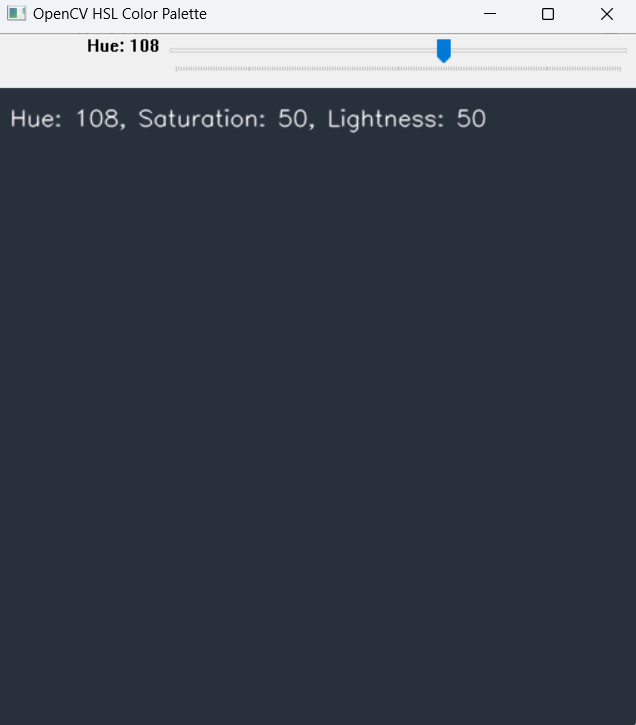
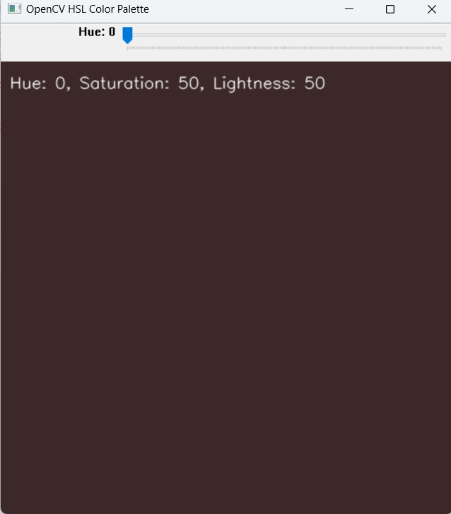

# OpenCV HSL Color Palette

This Python program creates an interactive HSL (Hue, Saturation, Lightness) color palette using OpenCV. The user can adjust the **Hue** value dynamically via a trackbar, while the Saturation and Lightness values are fixed. The resulting color is displayed in an OpenCV window, and the current HSL values are shown as text overlay on the image.

## Features

- **Dynamic Hue Adjustment**: Adjust the Hue value from 0 to 179 using a trackbar.
- **Fixed Saturation and Lightness**: Saturation and Lightness are fixed at 50, making Hue the primary adjustable parameter.
- **Color Display**: The selected color is shown in the OpenCV window, and it is updated in real-time as the Hue changes.

## Output

