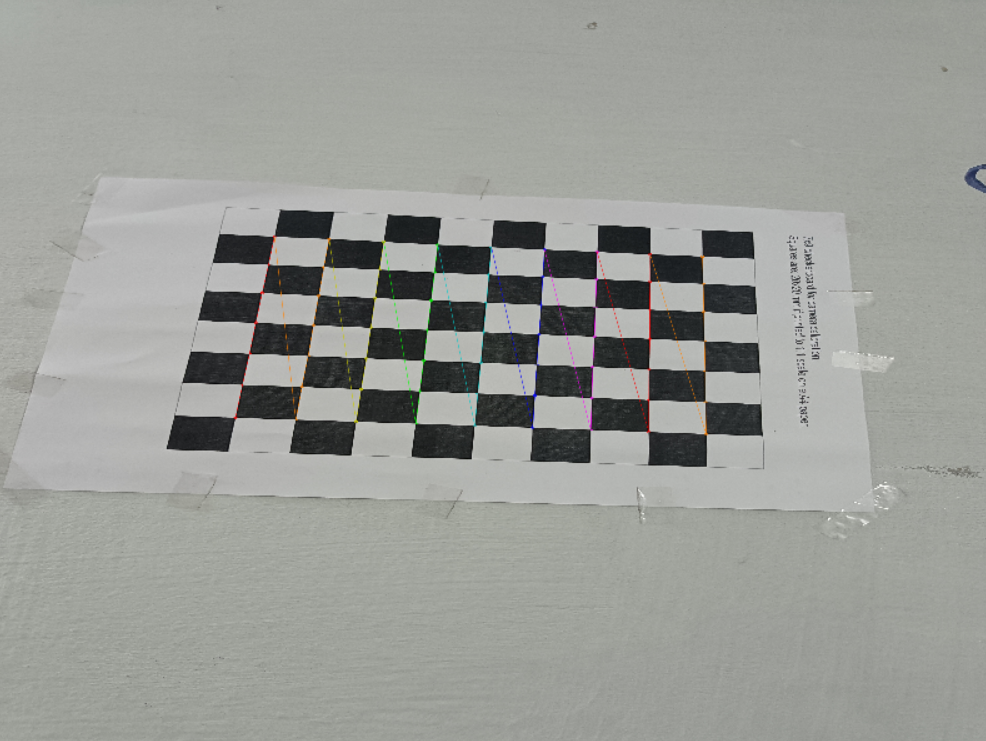
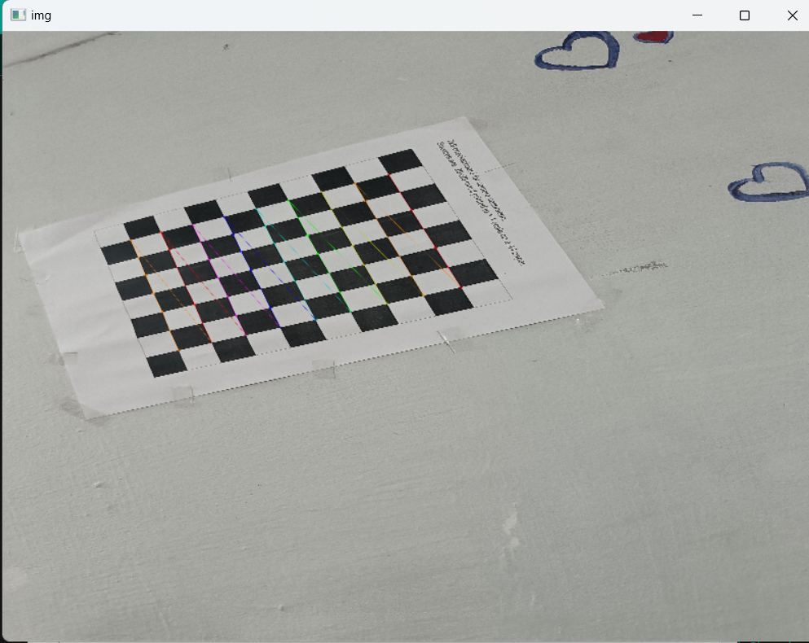
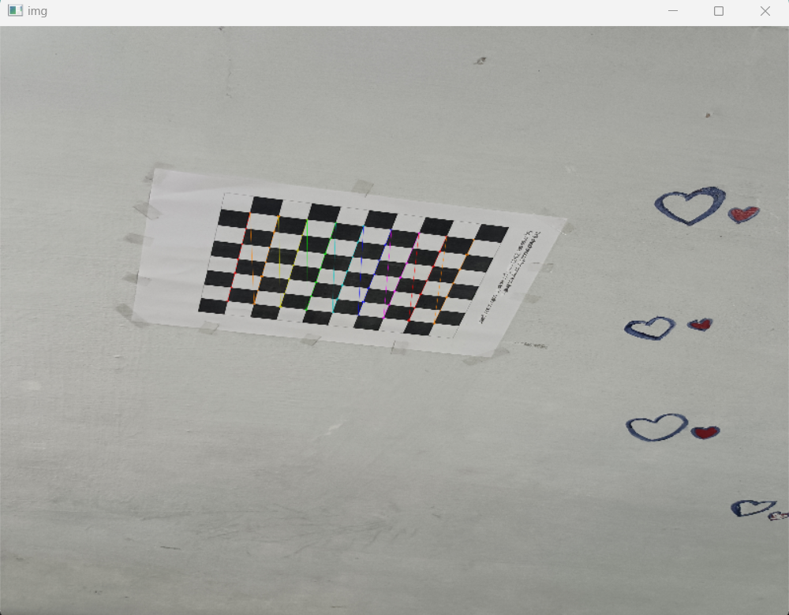
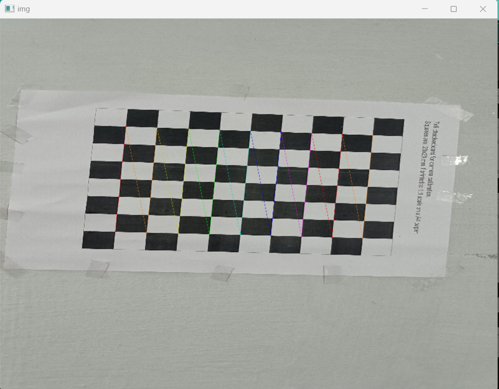
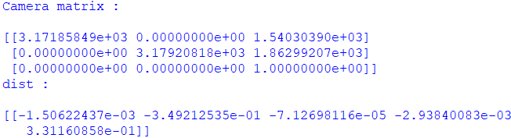
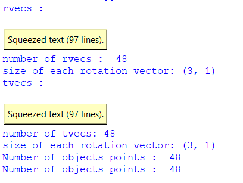
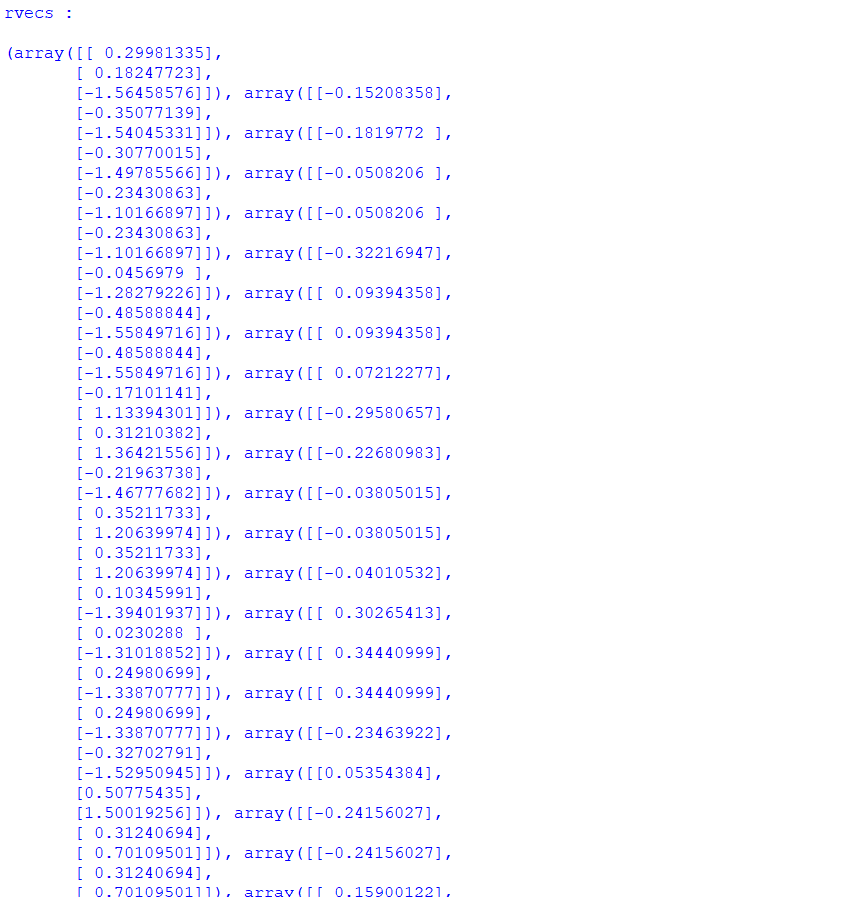
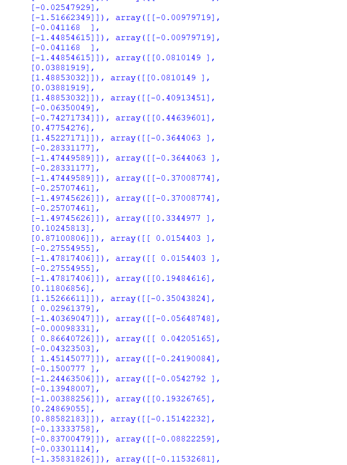
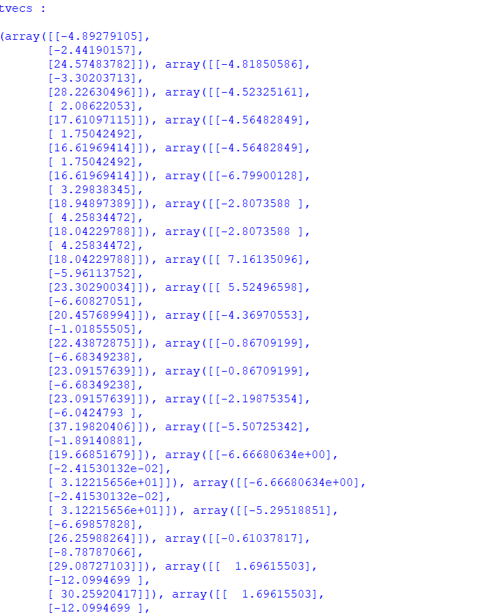
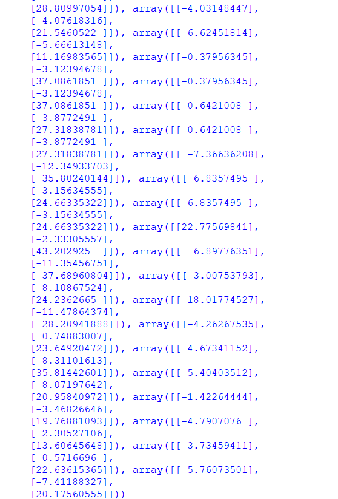

# 📷 Camera Calibration Project (Using a Phone Camera)

This project demonstrates the process of camera calibration using a checkerboard pattern to compute the intrinsic and extrinsic parameters of a phone's camera. Calibration helps in correcting distortions and accurately mapping 3D real-world points to 2D image points.

---

## 📜 Overview

### What is a Camera?
A camera is a device that converts the 3D world into a 2D image.

### What is Camera Calibration?
Camera calibration determines:
- **Intrinsic Parameters**: Properties of the camera, such as focal length and optical center.
- **Extrinsic Parameters**: Camera's position and orientation in 3D space.

### Why is Camera Calibration Important?
- Corrects lens distortions (common in phone cameras).
- Enables accurate mapping of 3D coordinates to 2D image points.
- Essential for 3D reconstruction, augmented reality, and robotic navigation.

---

## 🎯 Inputs and Outputs

### *Inputs*:
1. 3D object points (checkerboard coordinates)
2. 2D image points (detected corners on the checkerboard)

#### **1. 3D Object Points**:
- Represent 3D real-world points on the checkerboard.
- For a \(7 \times 9\) checkerboard, the total corners are \(7 \times 9 = 63\).
- Assumes all points lie on the \(XY\)-plane (\(Z = 0\)).

#### **32 Image Points**:
- Detected using OpenCV's `cv2.findChessboardCorners()`.
- Refined for sub-pixel accuracy with `cv2.cornerSubPix()`.

### *Outputs*:
1. Camera matrix
2. Distortion coefficients
3. Rotational vectors
4. Translational vectors

#### 1. **Camera Matrix (Intrinsic Parameters)**:
   \[
   K = \begin{bmatrix} f_x & 0 & c_x \\ 0 & f_y & c_y \\ 0 & 0 & 1 \end{bmatrix}
   \]
   Where:
   - \( f_x, f_y \): Focal lengths (in pixels).
   - \( c_x, c_y \): Optical center (in pixels).

#### 2. **Distortion Coefficients**:
   - **Radial Distortion** (\( k_1, k_2, k_3 \)): Corrects curved lines caused by lens shape.
   - **Tangential Distortion** (\( p_1, p_2 \)): Corrects misalignment of the lens.

#### 3. **Rotation Vectors**:
   - Describes how the camera is rotated relative to the checkerboard.

#### 4. **Translation Vectors**:
   - Defines the camera's position in relation to the checkerboard.

---

## 📊 Results

